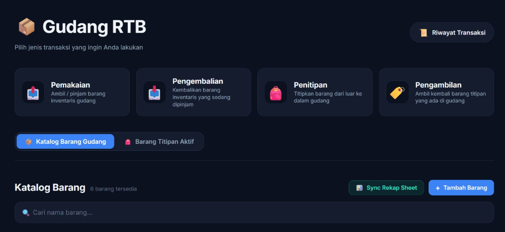
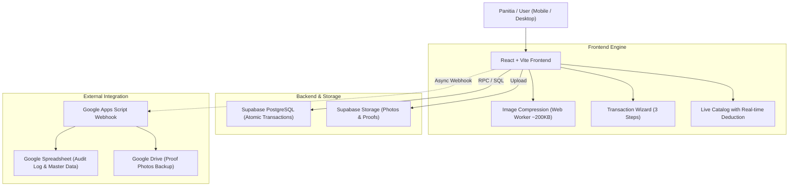

# 📦 Gudang RTB — Inventory & Borrowing Management System

[](https://reactjs.org/)
[](https://vitejs.dev/)
[](https://supabase.com/)
[](https://www.google.com/sheets/about/)
[](LICENSE)

Aplikasi manajemen inventaris dan sistem peminjaman logistik berbasis web yang dirancang khusus untuk panitia event dan tim operasional gudang. Menggantikan pencatatan manual berbasis spreadsheet/chat dengan sistem terintegrasi yang **real-time**, **atomik (anti race-condition)**, serta dilengkapi **sinkronisasi otomatis ke Google Sheets & Drive**.



---

## 🚀 Fitur Utama

### 1. 🔄 Multi-Step Transaction Wizard (Alur Transaksi Bertahap)
Memandu panitia melakukan transaksi dalam 3 langkah mudah:
- **Langkah 1: Identitas** — Pencatatan nama panitia penanggung jawab, nama event/divisi, dan catatan kebutuhan.
- **Langkah 2: Pemilihan Barang & Keranjang Lokal**
  - **Pemakaian Barang (*Consumable & Non-Consumable*)**: Pilih barang dari katalog visual dengan kalkulasi **sisa stok real-time** (stok pada kartu katalog otomatis berkurang saat ditambahkan ke keranjang).
  - **Pengembalian Barang**: Mengembalikan barang non-consumable yang sedang dipinjam dengan validasi jumlah barang yang aktif dipakai.
  - **Penitipan Barang**: Pencatatan barang dari luar yang dititipkan ke gudang lengkap dengan rincian dan foto bukti wajib.
  - **Pengambilan Barang Titipan**: Serah terima pengambilan barang titipan dari daftar titipan aktif.
- **Langkah 3: Konfirmasi & Multi-Foto Bukti** — Ringkasan detail transaksi sebelum submit dan upload multi-foto bukti serah terima (hingga 5 foto).

### 2. ⚡ Sinkronisasi Stok Real-Time & Atomisitas Database (PostgreSQL RPC)
- **Logika Cerdas Consumable vs Non-Consumable**:
  - *Consumable* (habis pakai: lakban, baterai, kabel ties): Stok berkurang saat diambil; otomatis diarsipkan (*auto-archive*) jika stok mencapai 0.
  - *Non-Consumable* (barang pinjam-kembali: proyektor, kabel HDMI, HT): Membedakan jumlah `Tersedia` (*available*) dan `Sedang Dipakai` (*in use*). Total stok selalu konsisten.
- **Transaksi Atomik via PostgreSQL Function**: Seluruh proses *checkout* multi-item dijalankan dalam satu blok transaksi database (`process_checkout_transaction`) untuk mencegah *race condition* (anti stok minus).

### 3. 🖼️ Kompresi Multi-Foto Sisi Klien (Client-Side Compression)
- Pengambilan foto langsung dari kamera HP atau galeri.
- Kompresi gambar otomatis di sisi browser menggunakan **Web Worker** (`browser-image-compression`) ke ukuran ~200KB sebelum diunggah ke Supabase Storage.
- Menghemat kuota storage Supabase dan memastikan proses upload tetap kilat pada koneksi seluler lapangan.

### 4. 📊 Integrasi Otomatis Google Sheets & Google Drive (Dual Backup)
- Setiap transaksi otomatis dicatat ke Google Spreadsheet melalui webhook Google Apps Script secara *asynchronous* (non-blocking).
- Foto bukti transaksi otomatis diunggah dan disimpan ke folder Google Drive terkait.
- Fitur **"Sync Rekap Sheet"** pada katalog untuk menyinkronkan seluruh master data stok barang ke Google Spreadsheet kapan saja dengan 1 klik.

### 5. 🔍 Smart Catalog & Riwayat Transaksi
- **Pencarian Instan**: Filter barang cepat berdasarkan nama barang.
- **Visual Status Badges**:
  - 🟢 **Hijau**: Stok melimpah (> 3 unit)
  - 🟡 **Kuning/Oranye**: Sisa stok menipis (≤ 3 unit)
  - 🔴 **Merah**: Stok habis
- **Modal Detail & Riwayat Barang**: Menampilkan rincian barang, status konsumsi, tombol edit bagi PIC gudang, serta riwayat pemakaian khusus per barang.
- **Audit Log Lengkap**: Memeriksa log seluruh transaksi dengan pratinjau foto bukti dan filter pencarian.

---

## 🛠️ Arsitektur & Tech Stack



| Layer | Teknologi | Keterangan |
|---|---|---|
| **Frontend** | React 18, Vite | Single Page Application (SPA), Mobile-First UI |
| **Styling** | Vanilla CSS (CSS Variables) | Modern Dark Theme, Responsive Grid & Flexbox |
| **Backend & DB** | Supabase (PostgreSQL) | Relational Schema, Atomic RPC, Row Level Security |
| **Storage** | Supabase Storage | Bucket `item-photos` & `transaction-proofs` |
| **Compression** | `browser-image-compression` | Multi-threading Web Worker image optimizer |
| **Cloud Sync** | Google Apps Script Webhook | Backup data transaksi ke Google Sheets & Drive |

---

## 📂 Struktur Database

### 1. Tabel: `items` (Master Data Barang)
Menyimpan informasi seluruh barang inventaris di gudang.

| Kolom | Tipe Data | Keterangan & Constraint |
|---|---|---|
| `id` | `uuid` | Primary Key (`gen_random_uuid()`) |
| `name` | `text` | Nama barang *(NOT NULL)* |
| `description` | `text` | Deskripsi / spesifikasi barang *(Opsional)* |
| `photo_url` | `text` | URL foto barang dari Supabase Storage |
| `is_consumable` | `boolean` | `true` = Habis pakai, `false` = Pinjam-kembali |
| `stock_available` | `integer` | Jumlah unit siap pakai *(DEFAULT 0, CHECK >= 0)* |
| `stock_in_use` | `integer` | Jumlah unit sedang dipinjam *(DEFAULT 0, CHECK >= 0)* |
| `unit` | `text` | Satuan barang (pcs, roll, unit, pack, dll.) *(DEFAULT 'pcs')* |
| `status` | `text` | Status barang (`'active'` atau `'archived'`) |
| `created_at` | `timestamptz` | Waktu barang ditambahkan *(DEFAULT now())* |

---

### 2. Tabel: `transactions` (Header Transaksi)
Menyimpan riwayat setiap sesi transaksi yang dilakukan oleh panitia.

| Kolom | Tipe Data | Keterangan & Constraint |
|---|---|---|
| `id` | `uuid` | Primary Key (`gen_random_uuid()`) |
| `transaction_type` | `text` | Tipe transaksi: `'pemakaian'`, `'pengembalian'`, `'penitipan'`, `'pengambilan'` |
| `actor_name` | `text` | Nama panitia penanggung jawab *(NOT NULL)* |
| `event_name` | `text` | Divisi atau nama event *(NOT NULL)* |
| `proof_photo_url` | `text` | URL multi-foto bukti serah terima (dipisahkan koma) |
| `notes` | `text` | Catatan transaksi / rincian barang titipan |
| `related_transaction_id` | `uuid` | Foreign Key ke `transactions.id` (khusus alur pengambilan barang titipan) |
| `created_at` | `timestamptz` | Waktu transaksi disubmit *(DEFAULT now())* |

---

### 3. Tabel: `transaction_details` (Rincian Isi Keranjang)
Menyimpan daftar item dan kuantitas barang dalam satu transaksi pemakaian/pengembalian.

| Kolom | Tipe Data | Keterangan & Constraint |
|---|---|---|
| `id` | `uuid` | Primary Key (`gen_random_uuid()`) |
| `transaction_id` | `uuid` | Foreign Key ➔ `transactions.id` *(ON DELETE CASCADE)* |
| `item_id` | `uuid` | Foreign Key ➔ `items.id` *(ON DELETE RESTRICT)* |
| `quantity` | `integer` | Jumlah barang dalam transaksi ini *(CHECK > 0)* |
| `created_at` | `timestamptz` | Waktu detail dibuat *(DEFAULT now())* |

---

## 💻 Memulai (Getting Started)

### 1. Prasyarat
- Node.js (v18.x atau lebih baru)
- npm atau yarn
- Proyek Supabase aktif

### 2. Kloning Repositori
```bash
git clone https://github.com/satyavirya-a/RTB-InventoryManagementSystem.git
cd RTB-InventoryManagementSystem
```

### 3. Instal Dependensi
```bash
npm install
```

### 4. Konfigurasi Environment Variable
Buat file `.env.local` di direktori *root* proyek:
```env
VITE_SUPABASE_URL=https://your-project-id.supabase.co
VITE_SUPABASE_ANON_KEY=your-anon-public-key
VITE_GOOGLE_APPS_SCRIPT_URL=https://script.google.com/macros/s/your-deployment-id/exec
```

### 5. Setup Database Supabase
Jalankan skrip SQL yang tersedia pada file [`docs/sql-schema.sql`](docs/sql-schema.sql) di **SQL Editor** Supabase untuk membuat tabel, function RPC, bucket storage, dan RLS policy.

### 6. Menjalankan Aplikasi
```bash
npm run dev
```
Buka browser di `http://localhost:5173`.

---

## 📦 Build untuk Production

Untuk membuat *production bundle*:
```bash
npm run build
```
Hasil build akan berada di direktori `dist/` dan siap di-deploy ke Vercel, Netlify, atau web hosting lainnya.

---

## 📄 Lisensi
Didistribusikan di bawah lisensi MIT. Lihat file `LICENSE` untuk informasi selengkapnya.
